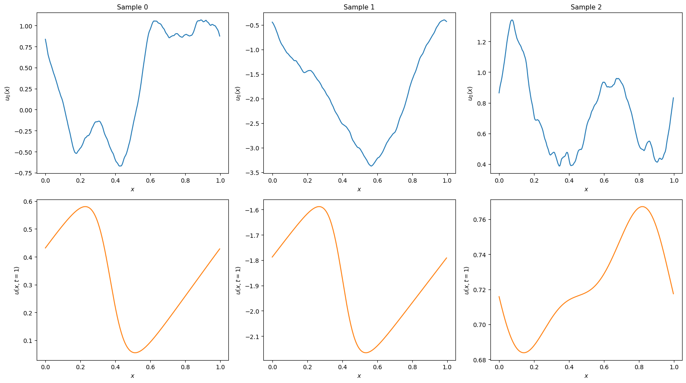

# Generating training data for Burgers' equation in 1D

This example demonstrates how to generate training data for a neural operator
to predict solutions of Burgers' equation in 1D. The data is generated
according to the method described in Li, Zongyi, et al. 
"Fourier neural operator for parametric partial differential equations." 
arXiv preprint arXiv:2010.08895 (2020).

Users that just want to run a script without reading
this tutorial can check out `examples/burgers1d/generate.py` on
[GitHub](https://github.com/christianfenton/norax).

**Note:** This tutorial requires users to have `pyarrow` and
[pardax](https://github.com/christianfenton/pardax) installed.

## Problem statement

The 1D viscous Burgers' equation on a periodic domain $x \in [0, 1)$ reads

$$
\frac{\partial u}{\partial t}
= -u\frac{\partial u}{\partial x} + \nu\frac{\partial^2 u}{\partial x^2},
$$

where $\nu > 0$ is the kinematic viscosity. The task is to generate
input-output pairs $u_0(x) = u(x, t=0)$ and $u(x, t=1)$,
where the initial conditions are drawn from a Gaussian random field:

$$ u_0 \sim \mathcal{N}\left(0,\; 625(-\Delta + 25I)^{-2}\right), $$

where $\Delta$ is the Laplacian.

## Setup

```python
import json
import math
import pathlib

import equinox as eqx
import jax
import jax.numpy as jnp
import numpy as np
import pardax as pdx
import pyarrow as pa
import pyarrow.parquet as pq

nu = 0.02  # Kinematic viscosity
L = 1.0  # Domain length
resolution = 256  # Number of grid points
dx = L / resolution  # Grid spacing
x = np.linspace(0, L, num=resolution, endpoint=False)  # Grid points
```

## Initial conditions

Initial conditions are sampled from a Gaussian random field. In Fourier space,
the Laplacian is diagonal with eigenvalues $-k^2$, where $k$ is the wavevector.

```python
class GaussianField1D(eqx.Module):
    """Sample 1D fields from N(0, 625(-Δ + 25I)^{-2}) on a periodic grid."""

    coef: jax.Array
    k: jax.Array
    n: int
    L: float

    def __init__(self, n: int, L: float) -> None:
        self.n = n
        self.L = L
        k = 2 * jnp.pi * jnp.fft.fftfreq(n, d=L / n)
        self.k = k
        self.coef = jnp.sqrt(625 * (k**2 + 25) ** (-2))

    def sample(self, key: jax.Array) -> jax.Array:
        n = self.n
        coef = self.coef

        key_dc, key_re, key_im, key_nyq = jax.random.split(key, 4)
        dc = jax.random.normal(key_dc, (1,))

        m = (n - 1) // 2
        re_int = jax.random.normal(key_re, (m,))
        im_int = jax.random.normal(key_im, (m,))
        interior_modes = (re_int + 1j * im_int) / jnp.sqrt(2.0)

        if n % 2 == 0:
            nyquist = jax.random.normal(key_nyq, (1,))
            pos = jnp.concatenate([dc, interior_modes, nyquist])
        else:
            pos = jnp.concatenate([dc, interior_modes])

        neg = jnp.conj(jnp.flip(pos[1 : m + 1]))
        noise = jnp.concatenate([pos, neg])

        f_k = coef * noise
        f_x = jnp.fft.ifft(f_k) * n
        return jnp.real(f_x)
```

Set up the random field sampler and a batched sampling function:

```python
num_samples = 1280
batch_size = 64
key = jax.random.key(0)
grf = GaussianField1D(resolution, L)

sample_batch = jax.vmap(jax.jit(lambda key_: grf.sample(key_)))
```

## Numerical solver

The spatial derivatives are discretised using second-order accurate central
differences.

The advection and diffusion right-hand sides are defined as:

```python
def advection(t: float, u: jax.Array, params: dict) -> jax.Array:
    """-u * du/dx (periodic, central differences)."""
    dx = params["dx"]
    dudx = (jnp.roll(u, -1) - jnp.roll(u, 1)) / (2 * dx)
    return -u * dudx


def diffusion(t: float, u: jax.Array, params: dict) -> jax.Array:
    """nu * d²u/dx² (periodic, central differences)."""
    nu, dx = params["nu"], params["dx"]
    return nu * (jnp.roll(u, -1) - 2 * u + jnp.roll(u, 1)) / dx**2
```

The solution is advanced through time with an implicit-explicit (IMEX) scheme.
The advective term is advanced with a fourth-order Runge-Kutta (RK4) method and the
diffusive term is advanced with a backward Euler method.

The linear system resulting from the discretisation of the diffusive term
is diagonalised in Fourier space using the eigenvalues $\sigma_k$
of the second-order central difference stencil on a periodic grid, where

$$
\sigma_k = \frac{-4\sin^2(k\Delta x/2)}{\Delta x^2}.
$$

The implicit system at each time step reduces to a pointwise division in
frequency space rather than a full linear solve.

```python
k = 2 * jnp.pi * jnp.fft.rfftfreq(resolution, d=dx)
sigma = -4 * nu * jnp.sin(k * dx / 2) ** 2 / dx**2

operator = pdx.SpectralOperator(eigvals=sigma)

spectral_solver = pdx.SpectralSolver(
    forward=jnp.fft.rfft,
    backward=lambda x: jnp.fft.irfft(x, n=resolution),
)

root_finder = pdx.LinearRootFinder(
    linsolver=spectral_solver,
    operator=operator
)

explicit = pdx.RK4()
implicit = pdx.BackwardEuler(root_finder=root_finder)
```

```python
params = {"nu": nu, "dx": dx}
step_size = 1e-4
t_span = (0.0, 1.0)

num_steps = math.ceil((t_span[1] - t_span[0]) / step_size)
step_size = jnp.asarray((t_span[1] - t_span[0]) / num_steps)


def imex_step(carry, _):
    t, y, explicit, implicit = carry
    y_star, explicit = explicit(advection, t, y, step_size, params)
    y_new, implicit = implicit(diffusion, t, y_star, step_size, params)
    return (t + step_size, y_new, explicit, implicit), None


@jax.jit
def solve(y0):
    carry, _ = jax.lax.scan(
        imex_step, (t_span[0], y0, explicit, implicit), length=num_steps
    )
    return carry[1]

solve_batch = jax.vmap(solve)
```

For further details on numerical time integration in JAX, check out
[pardax](https://github.com/christianfenton/pardax) or
[diffrax](https://github.com/patrick-kidger/diffrax).

## Solving the PDE

Solve and visualise a few samples to confirm the setup looks right:

```python
import matplotlib.pyplot as plt

num_examples = 3
key, subkey = jax.random.split(key)
preview_keys = jax.random.split(subkey, num_examples)

y0_preview = sample_batch(preview_keys)

y_end_preview = solve_batch(y0_preview)

fig, axes = plt.subplots(2, num_examples, figsize=(16, 9), layout="tight")

for i in range(num_examples):
    axes[0, i].plot(x, y0_preview[i], color='C0')
    axes[0, i].set_xlabel("$x$", fontsize=10)
    axes[0, i].set_ylabel("$u_0(x)$", fontsize=10)
    axes[0, i].set_title(f"Sample {i}", fontsize=11)

    axes[1, i].plot(x, y_end_preview[i], color='C1')
    axes[1, i].set_xlabel("$x$", fontsize=10)
    axes[1, i].set_ylabel("$u(x, t=1)$", fontsize=10)

plt.show()
```



## Generating and saving the dataset

Rather than solving for all samples at once, we generate and write in batches
to keep peak memory usage bounded. Each batch is appended to a Parquet file
with columns `sample_id`, `x`, `u0`, and `u_end`. The dataset is saved as a
directory containing `data.parquet` and a `metadata.json` sidecar.

```python
dtype = np.float32
pa_float = pa.from_numpy_dtype(dtype)

schema = pa.schema(
    [
        pa.field("sample_id", pa.int64()),
        pa.field("x", pa.list_(pa_float)),
        pa.field("u0", pa.list_(pa_float)),
        pa.field("u_end", pa.list_(pa_float)),
    ]
)

dataset_dir = pathlib.Path("myburgersdataset")
dataset_dir.mkdir(parents=True, exist_ok=True)

with pq.ParquetWriter(
    dataset_dir / "data.parquet", schema, compression="snappy"
) as writer:
    for start in range(0, num_samples, batch_size):
        end = min(start + batch_size, num_samples)
        batch = end - start

        key, subkey = jax.random.split(key)
        batch_keys = jax.random.split(subkey, batch)
        y0 = sample_batch(batch_keys)  # (batch, resolution)
        y_end = solve_batch(y0)  # (batch, resolution)

        y0_np = np.asarray(y0, dtype=dtype)
        y_end_np = np.asarray(y_end, dtype=dtype)
        sample_ids = np.arange(start, end, dtype=np.int64)
        # PyArrow list columns are stored as a flat values buffer plus an
        # offsets array where offsets[i] is the start of row i, so row i
        # spans flat_values[offsets[i]:offsets[i+1]].
        offsets = np.arange(
            0, (batch + 1) * resolution, resolution, dtype=np.int32
        )

        rb = pa.RecordBatch.from_arrays(
            [
                pa.array(sample_ids, type=pa.int64()),
                pa.ListArray.from_arrays(
                    pa.array(offsets, type=pa.int32()),
                    pa.array(np.tile(x, batch), type=pa_float),
                ),
                pa.ListArray.from_arrays(
                    pa.array(offsets, type=pa.int32()),
                    pa.array(y0_np.flatten(), type=pa_float),
                ),
                pa.ListArray.from_arrays(
                    pa.array(offsets, type=pa.int32()),
                    pa.array(y_end_np.flatten(), type=pa_float),
                ),
            ],
            schema=schema,
        )
        writer.write_batch(rb)

        print(f"  {end}/{num_samples} samples generated")

metadata = {
    "nu": nu,
    "dt": float(step_size),
    "t_end": 1.0,
    "resolution": resolution,
    "L": L,
    "seed": 0,
    "num_samples": num_samples,
    "dtype": "float32",
}
with open(dataset_dir / "metadata.json", "w") as f:
    json.dump(metadata, f, indent=2)

print(f"Dataset saved to {dataset_dir}")
```

```txt
  64/1280 samples generated
  128/1280 samples generated
  192/1280 samples generated
  ...
  1216/1280 samples generated
  1280/1280 samples generated
Dataset saved to myburgersdataset
```
