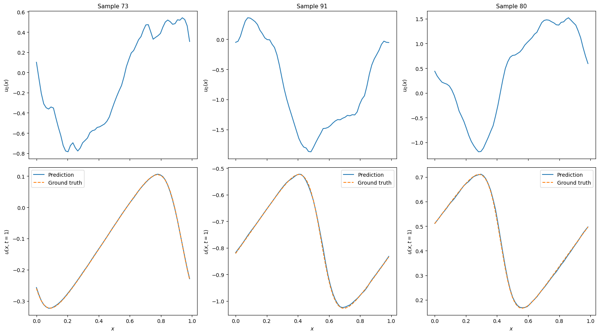

# Training an FNO on Burgers' equation in 1D

This tutorial demonstrates how to train a Fourier neural operator to
predict solutions of Burgers' equation in 1D. Users that want to just
run a training script without reading this tutorial
can look at `examples/burgers1d/train.py` on
[GitHub](https://github.com/christianfenton/norax).

For details on how the training data is generated, see
[Generating Training Data on Burgers' Equation in 1D](generation.md).

**Note:** This tutorial requires users to have `h5py`, `optax`, `matplotlib`
installed.

## Problem statement

Burgers' equation in 1D on a periodic domain $x \in [0, 1)$ reads

$$
\frac{\partial u}{\partial t}
= -u\frac{\partial u}{\partial x} + \nu\frac{\partial^2 u}{\partial x^2},
$$

where $\nu > 0$ is the kinematic viscosity. The first term is a non-linear
advective term and the second is a diffusive term.

The learning task is to approximate the solution operator
$$ \mathcal{G}^\dagger : u_0 \mapsto u(\cdot,\, t_\text{end}), $$
mapping an initial condition $u_0$ to the solution at time $t_\text{end}$.

## Loading the data

```python
import json

import equinox as eqx
import h5py
import jax
import jax.numpy as jnp
import numpy as np
import optax
from functools import partial

from norax.data import DataLoader
from norax.models import FNO

def load_data(path):
    """Load inputs, outputs, and metadata from an HDF5 file."""
    with h5py.File(path, "r") as f:
        inputs = np.asarray(f["inputs"])
        outputs = np.asarray(f["outputs"])
        metadata = dict(f.attrs)
    return inputs, outputs, metadata
```

```python
inputs, outputs, metadata = load_data("myburgersdataset.h5")

print("metadata:", metadata)
print("inputs.shape:", inputs.shape)
print("outputs.shape:", outputs.shape)
```

```txt
metadata: {'L': 1.0, 'dt': 0.0001, 'nu': 0.02, 'num_samples': 1280, 'resolution': 256, 't_end': 1.0}
inputs.shape: (1280, 256, 2)
outputs.shape: (1280, 256, 1)
```

Downsample the data to speed up training:

```python
def downsample(inputs, outputs, target_res):
    """Downsample inputs and outputs to a coarser spatial resolution.

    Args:
        inputs: Array of shape ``(N, res, 2)``
        outputs: Array of shape ``(N, res, 1)``
        target_res: Desired number of grid points after subsampling

    Returns:
        Downsampled inputs and outputs
    """
    orig_res = inputs.shape[1]
    if orig_res % target_res != 0:
        raise ValueError(
            f"Original resolution {orig_res} is not evenly divisible by "
            f"target resolution {target_res}."
        )
    stride = orig_res // target_res
    return inputs[:, ::stride, :], outputs[:, ::stride, :]
```

```python
inputs, outputs = downsample(inputs, outputs, 64)

print("inputs.shape:", inputs.shape)
print("outputs.shape:", outputs.shape)
```

```txt
inputs.shape: (1280, 64, 2)
outputs.shape: (1280, 64, 1)
```

Split the data into train and test sets and build data loaders:

```python
n_train = 1024
n_test = 256

inputs_jax = jnp.asarray(inputs[: n_train + n_test])
outputs_jax = jnp.asarray(outputs[: n_train + n_test])

train_data = {"input": inputs_jax[:n_train], "output": outputs_jax[:n_train]}
test_data = {"input": inputs_jax[n_train:], "output": outputs_jax[n_train:]}

batch_size = 32
train_loader = DataLoader(train_data, batch_size, shuffle=True, seed=0)
test_loader = DataLoader(test_data, batch_size, shuffle=False, seed=0)
```

## Model

```python
key = jax.random.key(0)
key, subkey = jax.random.split(key)

model = FNO(
    key=subkey,
    channels_in=2,
    channels_out=1,
    n_modes=(16,),
    width=64,
    depth=4,
)

print(model)
```

```txt
FNO(
  lift=MLP(
    activation=<function gelu>,
    depth=2,
    width=128,
    hidden_layers=(Linear(weight=f32[128,2], bias=f32[128]),),
    output_layer=Linear(weight=f32[64,128], bias=f32[64])
  ),
  project=MLP(
    activation=<function gelu>,
    depth=2,
    width=128,
    hidden_layers=(Linear(weight=f32[128,64], bias=f32[128]),),
    output_layer=Linear(weight=f32[1,128], bias=f32[1])
  ),
  fourier_layers=(
    Fourier(
      spectral=SpectralConv(
        channels_in=64,
        channels_out=64,
        n_modes=(16,),
        n_dims=1,
        weights_re=f32[64,64,16],
        weights_im=f32[64,64,16]
      ),
      linear=Linear(weight=f32[64,64], bias=f32[64]),
      activation=<function gelu>
    ),
    ...
  )
)
```

Verify that a forward pass works:

```python
jax.vmap(model)(train_data["input"][:2]).shape
```

```txt
(2, 64, 1)
```

## Evaluation

```python
def relative_l2(prediction: jax.Array, target: jax.Array) -> jax.Array:
    return jnp.linalg.norm(prediction - target) / jnp.linalg.norm(target)


@partial(jax.vmap, in_axes=(None, 0, 0))
def loss_fn(model: FNO, x: jax.Array, y: jax.Array) -> jax.Array:
    return relative_l2(model(x), y)


@jax.jit
def eval_step(model: FNO, x: jax.Array, y: jax.Array) -> jax.Array:
    return jnp.sum(loss_fn(model, x, y))


def evaluate(model: FNO, loader: DataLoader) -> float:
    total_loss = jnp.zeros(())
    n_samples = 0
    for batch in loader:
        x, y = batch["input"], batch["output"]
        n_samples += x.shape[0]
        total_loss += eval_step(model, x, y)
    return float(total_loss / n_samples)
```

## Training

Create an Adam optimiser with a learning rate that halves every 100 epochs:

```python
learning_rate = 1e-3
steps_per_epoch = len(train_loader)

schedule = optax.schedules.exponential_decay(
    learning_rate,
    transition_steps=steps_per_epoch * 100,
    decay_rate=0.5,
    staircase=True,
)

optimiser = optax.adam(schedule)
opt_state = optimiser.init(eqx.filter(model, eqx.is_array))
```

Define a single training step (batch update):

```python
@eqx.filter_jit
def train_step(
    model: FNO,
    opt_state: optax.OptState,
    optimiser: optax.GradientTransformation,
    x: jax.Array,
    y: jax.Array,
):
    loss, grads = eqx.filter_value_and_grad(
        lambda m: jnp.mean(loss_fn(m, x, y))
    )(model)
    updates, opt_state = optimiser.update(
        grads, opt_state, eqx.filter(model, eqx.is_array)
    )
    model = eqx.apply_updates(model, updates)
    return model, opt_state, loss * x.shape[0]
```

Define a training epoch:

```python
def run_epoch(
    model: FNO,
    opt_state: optax.OptState,
    optimiser: optax.GradientTransformation,
    loader: DataLoader,
):
    total_loss = jnp.zeros(())
    n_samples = 0
    for batch in loader:
        x, y = batch["input"], batch["output"]
        n_samples += x.shape[0]
        model, opt_state, batch_loss = train_step(
            model, opt_state, optimiser, x, y
        )
        total_loss += batch_loss
    return model, opt_state, float(total_loss / n_samples)
```

Run the training loop:

```python
n_epochs = 500

for epoch in range(1, n_epochs + 1):
    model, opt_state, train_loss = run_epoch(
        model, opt_state, optimiser, train_loader
    )
    train_loader.reset()

    if epoch % 10 == 0 or epoch == n_epochs:
        test_loss = evaluate(model, test_loader)
        test_loader.reset()
        print(
            f"Epoch {epoch:4d}/{n_epochs}  "
            f"train={train_loss:.4e}  test={test_loss:.4e}"
        )
```

```txt
Epoch   10/500  train=1.0623e-01  test=9.8970e-02
Epoch   20/500  train=6.6438e-02  test=6.6549e-02
Epoch   30/500  train=3.9810e-02  test=3.8570e-02
...
```

## Predictions

```python
import matplotlib.pyplot as plt

num_examples = 3
n_test = test_data["input"].shape[0]

key, subkey = jax.random.split(key)
random_inds = jax.random.choice(subkey, n_test, (num_examples,))

example_inputs = test_data["input"][random_inds]
example_outputs = test_data["output"][random_inds]
predictions = jax.vmap(model)(example_inputs)

fig, axes = plt.subplots(
    2, num_examples, figsize=(16, 9), layout="tight", sharex=True
)

for i in range(num_examples):
    idx = random_inds[i]
    x = example_inputs[i, :, 0]
    u0 = example_inputs[i, :, 1]
    v_true = example_outputs[i, ...]
    v_pred = predictions[i, ...]

    axes[0, i].plot(x, u0)
    axes[0, i].set_ylabel("$u_0(x)$", fontsize=10)
    axes[0, i].set_title(f"Sample {idx}", fontsize=11)

    axes[1, i].plot(x, v_pred, "-", label="Prediction")
    axes[1, i].plot(x, v_true, "--", label="Ground truth")
    axes[1, i].set_xlabel("$x$", fontsize=10)
    axes[1, i].set_ylabel("$u(x, t=1)$", fontsize=10)
    axes[1, i].legend(fontsize=10)

plt.show()
```



## Saving and loading models

```python
def save_model(path: str, model: FNO, hyperparams: dict) -> None:
    """Save model weights and hyperparameters to a binary file.

    The file format follows the Equinox recommended pattern:
    a JSON-encoded hyperparameter line followed by the serialised leaves.
    """
    with open(path, "wb") as f:
        f.write((json.dumps(hyperparams) + "\n").encode())
        eqx.tree_serialise_leaves(f, model)


def load_model(path: str):
    """Load a model previously saved with `save_model`."""
    with open(path, "rb") as f:

        hyperparams = json.loads(f.readline().decode())
        hyperparams["n_modes"] = tuple(hyperparams["n_modes"])
        skeleton = FNO(key=jax.random.key(0), **hyperparams)
        model = eqx.tree_deserialise_leaves(f, skeleton)
    return model, hyperparams
```

```python
hyperparams = {
    "channels_in": 2,
    "channels_out": 1,
    "n_modes": list((16,)),
    "width": 64,
    "depth": 4,
}

save_model("mymodel.eqx", model, hyperparams)
print("Model saved.")

# Verify that saving and loading works
model_loaded, hyperparams_loaded = load_model("mymodel.eqx")
print("Model loaded. hyperparams:", hyperparams_loaded)
```

```txt
Model saved.
Model loaded. hyperparams: {'channels_in': 2, 'channels_out': 1, 'n_modes': (16,), 'width': 64, 'depth': 4}
```
